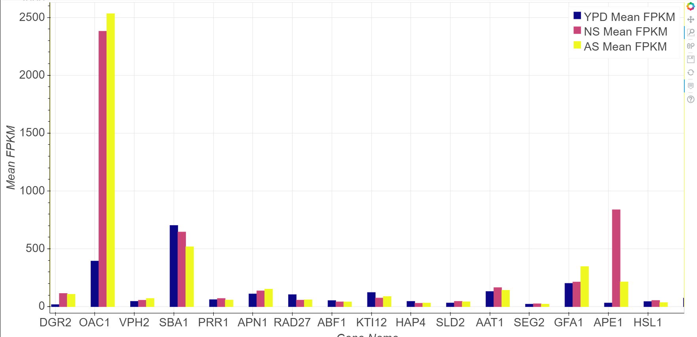
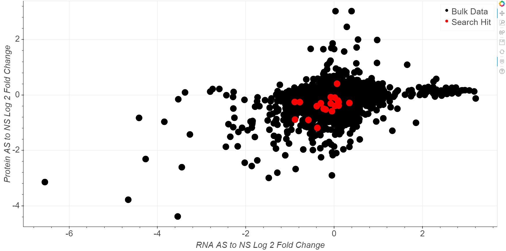
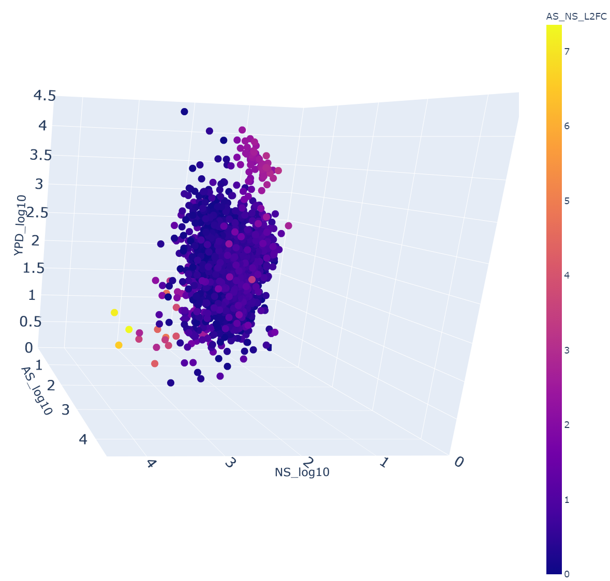

## Overview

This collection of JupyterLab notebooks and scripts was written to process, integrate and plot the results of an RNA sequencing and SILAC experiment preformed by members of the Klionsky lab at the University of Michigan. RNA and protein levels were measured in three distinct nutrient conditions: growing conditions, nitrogen starvation and amino acid starvation. First some basic data cleaning was performed. Next there is no truly unique identifier common to these two data sets so I used the Uniprot RESTful API to query the Genbank accession numbers found in the RNA data set and get the corresponding Uniprot accession number and gene name. These accession associations were then used to integrate the RNA seq and SILAC data sets into one file. Lastly, the Bokeh and Plotly packages were used to generate interactive plots with this data.

### Abbreviations
| Abbreviation | Meaning               |
| ------------ | --------------------- |
| YPD          | Growing conditions    |
| NS/SD-N      | Nitrogen starvation   |
| AS/SD-A      | Amino acid starvation |
| L2FC         | Log2 fold change      |

### Disclaimer

The ***results*** of these analyses **are not meant for the interpretation of outside researchers** as more data is needed in the form additional experimental replicates. Consequently, many details pertaining to the experimental procedures behind these data sets are not provided here; they will be provided in a subsequent paper. 

### Example plots

See "Plots" directory for interactive HTML versions of these plots.

